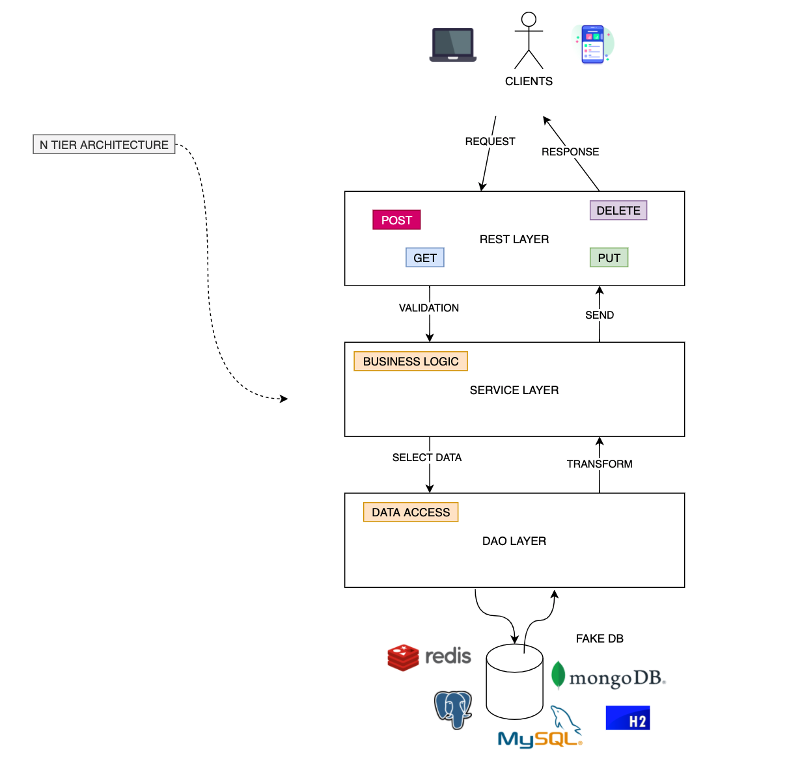

# spring-boot-master-class-course

This is a test from a course (available on https://amigoscode.com/) to understand and master a Spring Boot application.

It follows the pattern MVC with different layers as showed in the following image.

It contains just a few package, with a primary class for Customer.

# List of topics for this course
- Restful API's
- Logging
- N Tier Architecture
- Spring Boot Actuator
- Dependency Injection
- Unit Tests
- Integration Tests
- JSON Serialisation and Deserialisation
- Java Beans Validation
- Open Feign
- Exception Handling
- Lombok
- Running Spring Boot Applications

Every commit contains tests or different way to reach the same result.